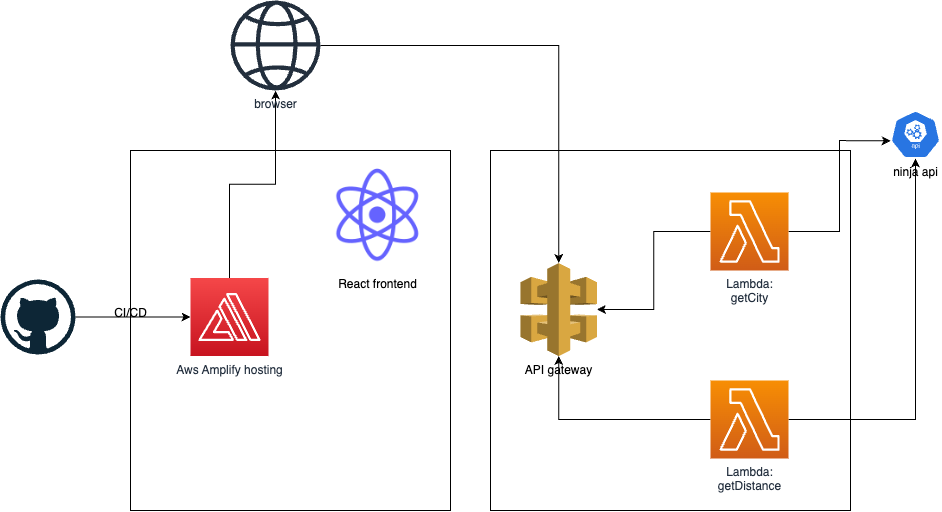
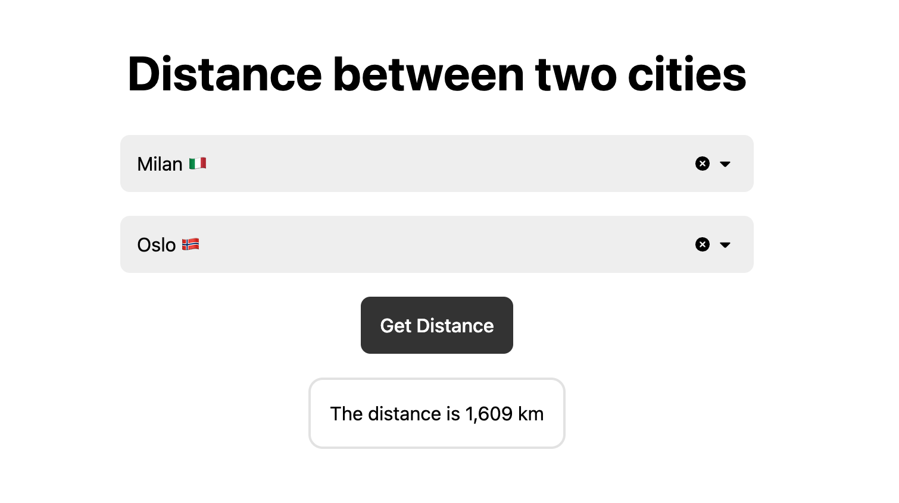
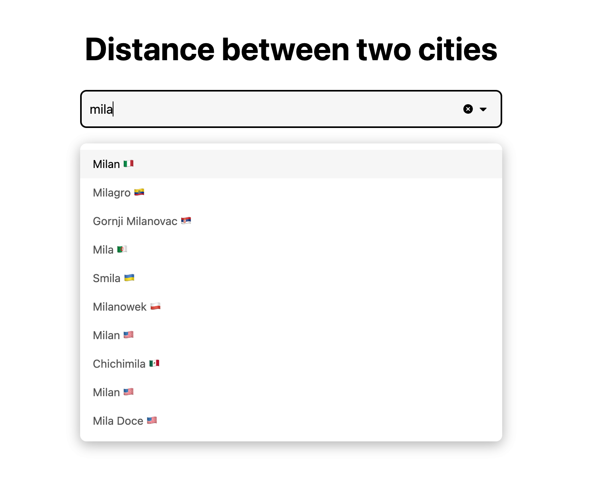

# City Distance Web Application

This is a web application that calculates the distance between two cities. It uses React with TypeScript as the frontend framework and the serverless framework to crate a backend service using AWS Lambda and API Gateway. 

~~You can find the deployed application [here](https://master.disqokagsd5iq.amplifyapp.com/)~~ Deployed app has been disabled to avoid unnecessary costs, you can deploy the application to your own AWS account.

## Architecture
  

## Repo Structure
this repo is composed by two main submodules:
- `frontend`: contains the frontend application
- `backend`: contains the backend application

More information about each submodule can be found in the README.md of each submodule.

## Known limitations and todos
* Since the calculation of the distance is not computational expensive, it would be better to do it on the frontend side, to get result faster and to avoid to call the api.

## Screenshots

